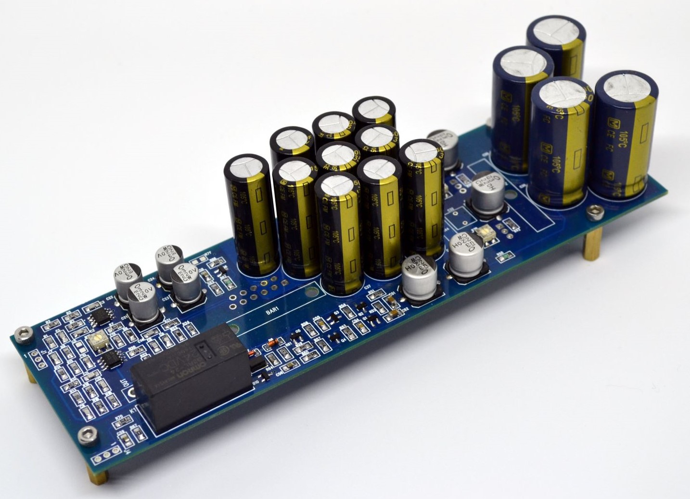

## LM3886 ZD-50

### Description
One of the best hi-fi lm3886 amplifier.

### Source
- [https://www.s-audio.com/](https://www.s-audio.com/)

### Authors
- Shematic and PCB design - [Nick](http://forum.vegalab.ru/member.php?u=939)

### Links
- [http://forum.vegalab.ru/showthread.php?t=20617](http://forum.vegalab.ru/showthread.php?t=20617)

### Buy parts for assembling
- [Order PCB from PCBWay](https://www.pcbway.com/project/shareproject/lm3886_zd_50.html)

### Related projects
- [Power supply for LM3886 ZD-50](https://github.com/diyaudioby/ps-zd-50)

### Folder structure
Most folder names are self explanatory.
- 3d - contains 3d models of PCB
- bom - contains the bill of materials
- docs - contains drawings and images outputs of schematic and PCB files, assembling manuals
- firmware - contains compiled binary files
- gerbers - contains zip file of the PCB Gerbers and drill drawings for manufacture
- images - contain photo of assembling prototype
- pcb - contains the original schematic and PCB design files (Altium Designer,  KiCAD, SprintLayout, etc)
- soft - contains custom software using, for example, for operate with this device 
- source - contains project souce code (sketchs for Arduino, files C/C++, etc)